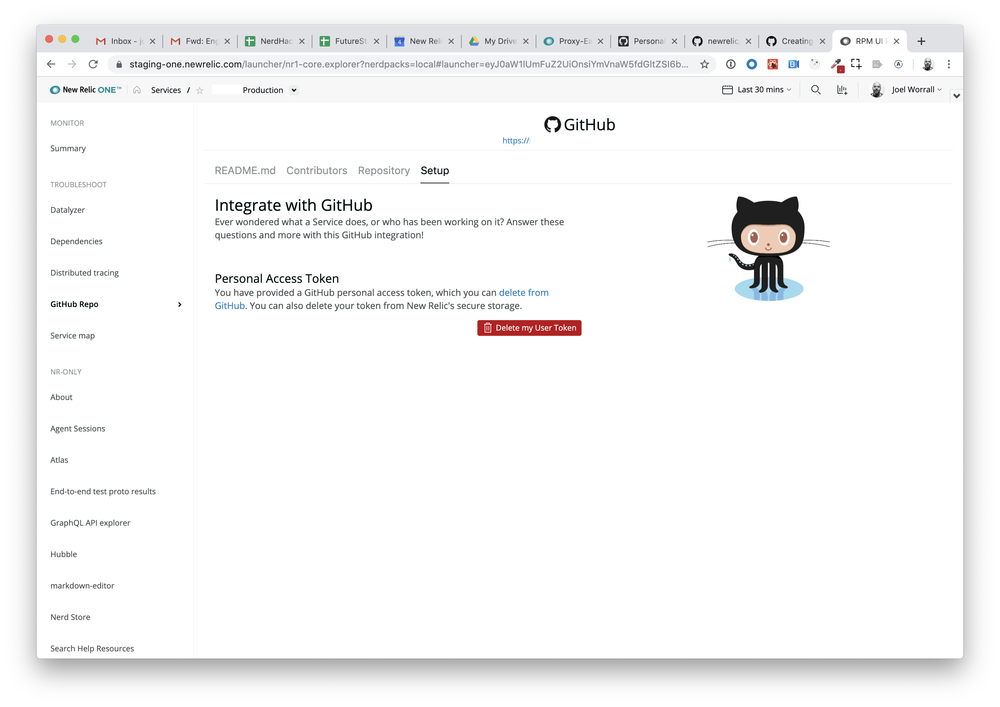
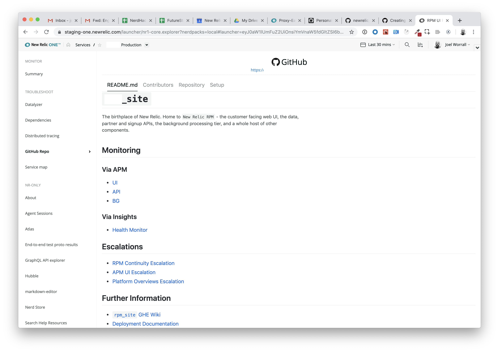
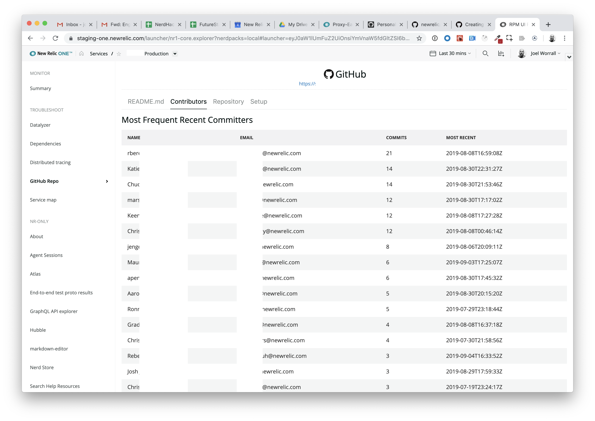
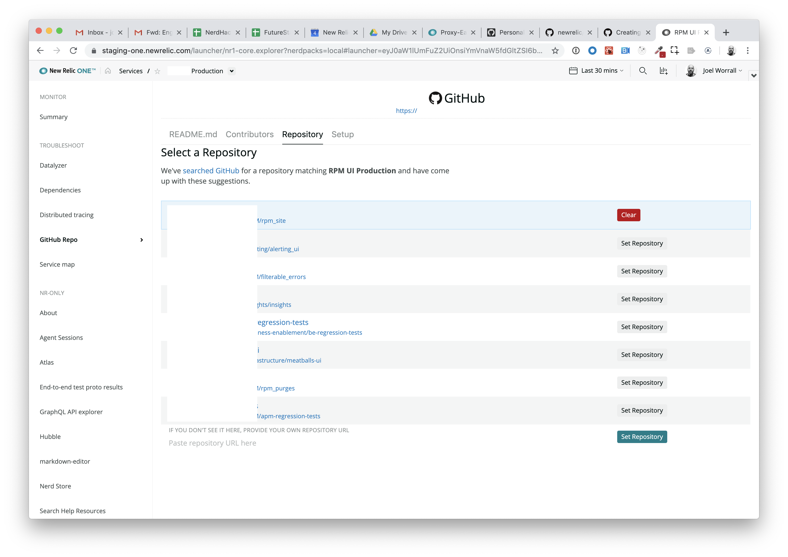

# nr1-github

  [](https://snyk.io/test/github/newrelic/nr1-github)

## Usage

Troubleshooting a service is faster when you can jump straight to the GitHub
repo to see how it works and who owns it. This integration connects your 
services and apps in New Relic One to your GitHub repo (either public or 
private enterprise instances).

Associate any service or application with its GitHub repository as a one-time action
and then you can quickly see that application's README file, as well as a list
of most active source code contributors.

## Screen Shots









## Open Source License

This project is distributed under the [Apache 2 license](LICENSE).

## What do you need to make this work?

1. A GitHub (either public or private enterprise instance) organization and access to [New Relic One](https://newrelic.com/platform).
2. The ability to generate a [personal access token](https://help.github.com/en/articles/creating-a-personal-access-token-for-the-command-line) in GitHub.

### Using GitHub Personal Access Tokens

Integration with GitHub requires the user to create or use a private
access token as a one-time setup step. This GitHub personal access token
increases security, because it ensures each user can only see repositories
they have access to. New Relic will store that access token, but the user 
can easily delete it from New Relic's storage at any time.

We recommend creating a dedicated personal access token for this application only,
and you should give that token `read only` permissions. See 
[GitHub's doc on access tokens](https://help.github.com/en/articles/creating-a-personal-access-token-for-the-command-line)
for full instructions.

Personal access tokens are stored with New Relic One's `UserStorage`
APIs. `UserStorage` data is accessible only to the user account and `Nerdpack` which created it. The data is encrypted in transmission, but is not encrypted at rest (within the underlying database). Because of this, `UserStorage` data may be accessible to a New Relic employee via an administrative privilege in the platform.

## Getting started

Clone this repository and run the following scripts:

```bash
git clone https://github.com/newrelic/nr1-github.git
cd nr1-github
nr1 nerdpack:uuid -gf
npm install
npm start
```

Visit [https://one.newrelic.com/?nerdpacks=local](https://one.newrelic.com/?nerdpacks=local), navigate to the Nerdpack, and :sparkles:

## Deploying this Nerdpack

Open a command prompt in the nerdpack's directory and run the following commands.

```bash
# this is to create a new uuid for the nerdpack so that you can deploy it to your account
nr1 nerdpack:uuid -g [--profile=your_profile_name]
# to see a list of APIkeys / profiles available in your development environment, run nr1 credentials:list
nr1 nerdpack:publish [--profile=your_profile_name]
nr1 nerdpack:deploy [-c [DEV|BETA|STABLE]] [--profile=your_profile_name]
nr1 nerdpack:subscribe [-c [DEV|BETA|STABLE]] [--profile=your_profile_name]
```

Visit [https://one.newrelic.com](https://one.newrelic.com), navigate to the Nerdpack, and :sparkles:

## Support

New Relic has open-sourced this project. This project is provided AS-IS WITHOUT WARRANTY OR SUPPORT, although you can report issues and contribute to the project here on GitHub.

_Please do not report issues with this software to New Relic Global Technical Support._

### Community

New Relic hosts and moderates an online forum where customers can interact with New Relic employees as well as other customers to get help and share best practices. Like all official New Relic open source projects, there's a related Community topic in the New Relic Explorer's Hub. You can find this project's topic/threads here:

[https://discuss.newrelic.com/t/github-nerdpack/82932](https://discuss.newrelic.com/t/github-nerdpack/82932)
*(Note: URL subject to change before GA)*

### Issues / Enhancement Requests

Issues and enhancement requests can be submitted in the [Issues tab of this repository](../../issues). Please search for and review the existing open issues before submitting a new issue.

## Contributing

Contributions are welcome (and if you submit a Enhancement Request, expect to be invited to contribute it yourself :grin:). Please review our [Contributors Guide](CONTRIBUTING.md).

Keep in mind that when you submit your pull request, you'll need to sign the CLA via the click-through using CLA-Assistant. If you'd like to execute our corporate CLA, or if you have any questions, please drop us an email at opensource@newrelic.com.
